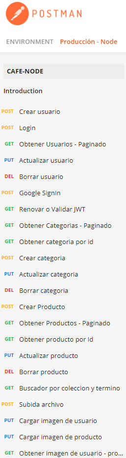

# WebServer + RestServer

```npm install``` para reconstruir los modulos de Node.

```Recordar``` configurar las variables de entorno.

# Documentación básica de los diferentes endpoints
https://documenter.getpostman.com/view/9798334/TzseK74F#fd64ed6c-b183-4f0a-b83a-a0b03ba2f473

